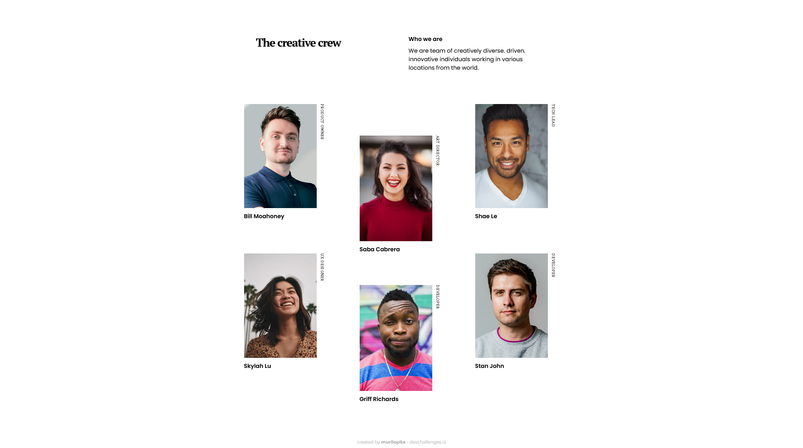

<!-- Please update value in the {}  -->

<h1 align="center">My Team Page</h1>

   Solution for a challenge from  <a href="http://devchallenges.io" target="_blank">Devchallenges.io</a>.

  <h3>
    <a href="https://murilopita.github.io/my-team-page-master/">
      Demo
    </a>
     | 
    <a href="https://devchallenges.io/challenges/hhmesazsqgKXrTkYkt0U">
      Challenge
    </a>
  </h3>

<!-- TABLE OF CONTENTS -->

## Table of Contents

- [Overview](#overview)
  - [Built With](#built-with)
- [Features](#features)
- [Contact](#contact)

<!-- OVERVIEW -->

## Overview

<h3 align='center'>Desktop Version</h3>

 
 

<h3 align='center'>Mobile Version</h3>

 
 

## Built With

<!-- This section should list any major frameworks that you built your project using. Here are a few examples.-->

- [HTML](https://developer.mozilla.org/pt-BR/docs/Web/HTML)
- [SEMANTIC HTML](https://www.w3schools.com/html/html5_semantic_elements.asp)
- [CSS](https://www.w3.org/Style/CSS/Overview.en.html)

 

## Features

<!-- List the features of your application or follow the template. Don't share the figma file here :) -->

This application/site was created as a submission to a [DevChallenges](https://devchallenges.io/) challenge. The [challenge](https://devchallenges.io/challenges/hhmesazsqgKXrTkYkt0U) was to build an application to complete the given user stories.

So, for this challenge I try to make with semantic HTML and some parts I used flex Box and for the members' area, I used flex Grid.

For Mobile version I changed the value of element: 'grid-template-columns' to fix the members' area in the screen.

 

## Contact

- GitHub [@murilopita](https://github.com/murilopita)
